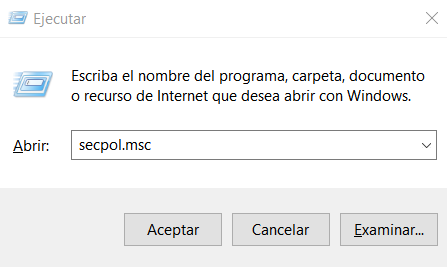
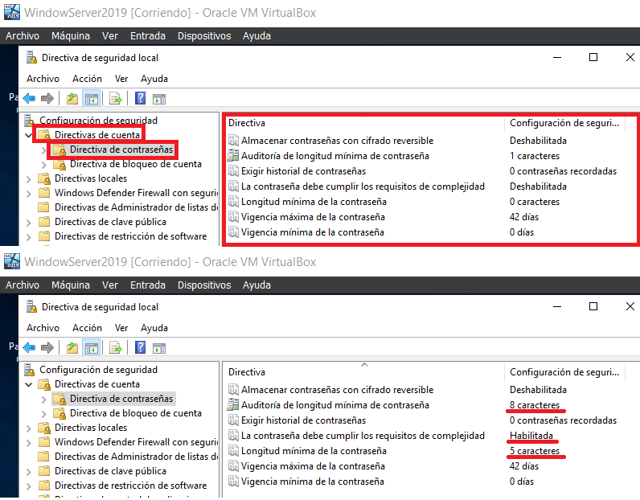
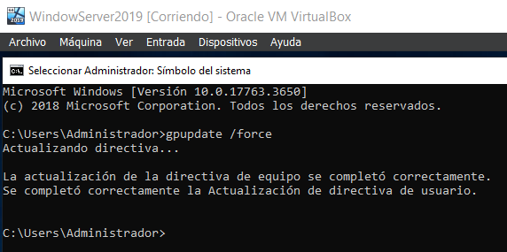
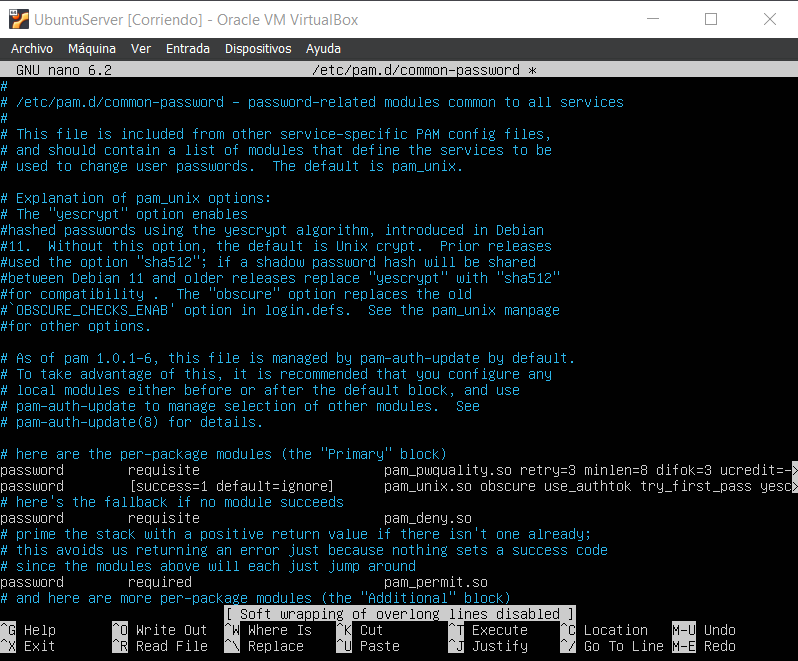
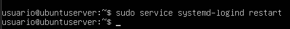
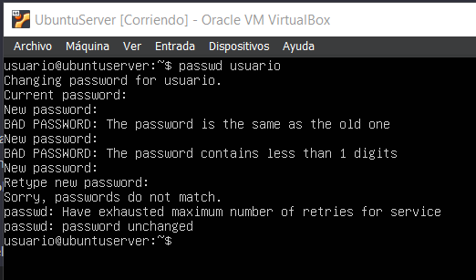
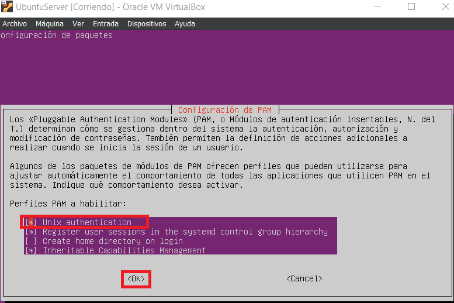

# <p align="center">**UNIDAD 3 - SEGURIDAD LÓGICA I**</p>

Autor: Damián Martín Carrasco

## Actividad 1.- Búsqueda de Información

## Actividad 2.- Configuración de Contraseñas Seguras en Windows y Linux

### <p align="center">**Windows Server**</p>

Una vez que estemos dentro de un Windows Server, tendremos que abrir el editor de directivas de seguridad local.

Para ello:

- Abrimos un cuadro de diálogo presionando las teclas `Win + R`

- Ahora escribimos `secpol.msc` y presionamos Enter.

<p align="center">
  
</p>

A continuación nos dirigimos hacia **"Directivas de cuenta" --> "Directivas de contraseñas"**

Nos aparecerán las directivas y podemos cambiar cualquiera de ellas que queramos, en este ejemplo se puede ver que se cambian tres directivas.

<p align="center">
  
</p>

Aquí una breve explicación de que hace cada una de las directivas:

1. **Almacenamiento de Contraseñas con Cifrado Reversible:**
   - **Función:** Determina si las contraseñas de las cuentas de usuario se almacenan utilizando un cifrado reversible. El cifrado reversible permite recuperar la contraseña original, lo cual es menos seguro.
   - **Configuración:** Se debe configurar como "Deshabilitado" para mejorar la seguridad, ya que el almacenamiento reversible de contraseñas presenta riesgos de seguridad significativos.

2. **Auditoría de Longitud Mínima de Contraseña:**
   - **Función:** Permite auditar eventos relacionados con la longitud mínima de las contraseñas.
   - **Configuración:** Se refiere a la longitud mínima que deben tener las contraseñas. La auditoría puede ayudar a detectar intentos de violación de políticas de contraseñas.

3. **Exigir Historial de Contraseñas:**
   - **Función:** Especifica el número de contraseñas anteriores que deben ser recordadas antes de permitir que un usuario pueda reutilizar una contraseña anterior.
   - **Configuración:** Al exigir un historial de contraseñas, se evita que los usuarios cambien a una contraseña anterior para eludir las políticas de seguridad.

4. **Requisitos de Complejidad de Contraseñas:**
   - **Función:** Obliga a que las contraseñas cumplan con ciertos requisitos de complejidad, como incluir caracteres especiales, números y letras mayúsculas y minúsculas.
   - **Configuración:** Mejora la seguridad al hacer que las contraseñas sean más difíciles de adivinar o de atacar mediante fuerza bruta.

5. **Longitud Mínima de la Contraseña:**
   - **Función:** Especifica la longitud mínima que deben tener las contraseñas.
   - **Configuración:** Establece un estándar mínimo para la longitud de las contraseñas, lo que contribuye a hacerlas más seguras al aumentar la complejidad.

6. **Longitud Máxima de la Contraseña:**
   - **Función:** Limita la longitud máxima que pueden tener las contraseñas.
   - **Configuración:** Aunque es menos común, puede haber situaciones en las que se quiera establecer un límite máximo para evitar abusos o errores.

7. **Vigencia Mínima de la Contraseña:**
   - **Función:** Establece el tiempo mínimo que una contraseña debe estar en uso antes de que el usuario pueda cambiarla.
   - **Configuración:** Ayuda a prevenir cambios frecuentes de contraseñas, lo que podría ser una práctica insegura si se hace con demasiada frecuencia.


Sabiendo esto, podemos cambiar las directivas que queramos adecuándolas a nuestras necesidades.

Después de hacer los cambios podemos cerrar la pestaña, abrimos una consola (cmd) y a continuación ejecutamos el siguiente comando:

```cmd
gpupdate /force
```

Tras esto, ya habremos terminado la configuración básica en las directivas de contraseñas de Windows Server.

<p align="center">
  
</p>

### <p align="center">**Ubuntu Server**</p>

La configuración en Ubuntu Server no es compleja tampoco.

Lo primero que habría que hacer es editar el archivo de configuración PAM, para ello abrimos el fichero con el siguiente comando:

```bash
sudo nano /etc/security/pwquality.conf
```

Una vez dentro agregaremos o modificaremos las reglas según nuestras necesidades.

<p align="center">
  
</p>

En este caso las reglas que se han modificado son las siguientes:

1. **Longitud Mínima de Contraseña (minlen):**
   - **Función:** Esta directiva especifica la longitud mínima que deben tener las contraseñas.
   - **Configuración:** Establece un estándar mínimo para la longitud de las contraseñas de los usuarios.

2. **Clases Mínimas de Caracteres (minclass):**
   - **Función:** Indica el número mínimo de clases de caracteres (letras, números, caracteres especiales, etc.) que deben estar presentes en una contraseña.
   - **Configuración:** Ayuda a garantizar que las contraseñas sean más robustas al requerir diversidad de tipos de caracteres.

3. **Repetición Máxima de Caracteres Consecutivos (maxrepeat):**
   - **Función:** Limita el número máximo de caracteres idénticos que pueden aparecer consecutivamente en una contraseña.
   - **Configuración:** Contribuye a evitar patrones predecibles en las contraseñas.

4. **Secuencias Máximas de Caracteres Consecutivos (maxsequence):**
   - **Función:** Define la cantidad máxima de caracteres que pueden formar una secuencia ascendente o descendente en una contraseña (por ejemplo, "abcd" o "8765").
   - **Configuración:** Mejora la resistencia contra contraseñas fácilmente adivinables.

5. **Configuración de Calidad de Contraseña (password requisite pam_pwquality.so retry=3):**
   - **Función:** Establece la configuración de calidad de contraseña y, en este caso, permite hasta 3 intentos para que el usuario proporcione una contraseña que cumpla con los requisitos establecidos.
   - **Configuración:** Ayuda a fortalecer la seguridad de las contraseñas al requerir ciertos criterios.

Una vez definidas las reglas, reiniciamos el servicio de autenticación con el siguiente comando:

```bash
sudo service systemd-logind restart
```

<p align="center">
  
</p>

Por último verificamos que la configuración se haya aplicado correctamente ejecutando el siguiente comando:

```bash
sudo pam-auth-update
```

<p align="center">
  
</p>

Nos aseguramos de que la opción `Unix authentication` esté seleccionada, ya que asegura que la configuración **pam_pwquality.so** se tenga en cuenta durante la untenticación del sistema.

<p align="center">
  
</p>

Y de esta manera ya acabamos con la configuración en Ubuntu Server.

## Actividad 3- Ataques contra contraseñas en Sistemas Windows – FICHERO SAM -

## Actividad 4- Ataques contra contraseñas en Sistemas Windows

## Actividad 5.- Ataques contra contraseñas en Sistemas Linux

## Actividad 6.- Realiza un listado de este tipo de herramientas y analiza la instalación y configuración de 2 congeladores

## Actividad 7: GRUB.

### a) Protege con contraseña el GRUB, para que no se pueda ejecutar secuencia de comandos, como root, en el arranque.

### b) Protege contraseña el arranque de los sistemas operativos.

## Actividad 8: Servidor Radius. Autenticación en redes inalámbricas.

### a) Instala y configura un servidor freeradius con soporte LDAP.

### b) Protege con credenciales de usuario una red inalámbrica, creada con un router Mikrotik.
