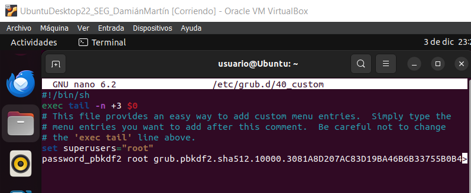

# Actividades Unidad 3 Seguridad

Autor: Damián Martín Carrasco

## Actividad 1.- Búsqueda de Información

1. **Editor de Directivas de Seguridad Local (Windows):**
   - **Descripción:** Herramienta integrada en sistemas Windows que permite configurar políticas de seguridad locales. Se utiliza para establecer restricciones y configuraciones de seguridad a nivel del sistema operativo.

2. **libpam (Linux):**
   - **Descripción:** Pluggable Authentication Modules (PAM) es un marco de autenticación utilizado en sistemas operativos basados en Unix. libpam es una biblioteca que facilita la implementación de esquemas de autenticación y autorización en Linux.

3. **RainbowCrack:**
   - **Descripción:** Herramienta para realizar ataques de fuerza bruta y recuperar contraseñas mediante el uso de tablas arcoíris precalculadas. Es eficaz para descifrar contraseñas que utilizan funciones hash débiles.

4. **Pwdump8:**
   - **Descripción:** Programa que extrae contraseñas en formato hash almacenadas en sistemas Windows. Pwdump8 obtiene información de hashes del archivo SAM (Security Account Manager) y permite su análisis.

5. **Hiren's BootCD:**
   - **Descripción:** Un conjunto de herramientas y utilidades en formato de CD de arranque que se utiliza para diagnóstico, reparación y recuperación de sistemas. Incluye una variedad de programas para diferentes tareas de mantenimiento y recuperación.

6. **John the Ripper:**
   - **Descripción:** Herramienta de cracking de contraseñas que utiliza métodos como fuerza bruta y ataques de diccionario para descifrar contraseñas almacenadas en formato hash. Es compatible con varios algoritmos de cifrado.

7. **Deep Freeze:**
   - **Descripción:** Software que protege la configuración del sistema congelando el estado actual. Cualquier cambio realizado durante el uso del sistema se revierte al reiniciar. Se utiliza para mantener la integridad del sistema.

8. **Toolwiz Time Freeze:**
   - **Descripción:** Aplicación similar a Deep Freeze que crea un entorno virtual para realizar cambios temporales en el sistema. Los cambios se eliminan al reiniciar, lo que ayuda a proteger la integridad del sistema.

9. **Grub2:**
   - **Descripción:** Grand Unified Bootloader, la segunda versión de Grub, es un gestor de arranque utilizado en sistemas basados en Unix y Linux. Se instala en el sector de arranque del disco y facilita la selección del sistema operativo al iniciar la computadora.

## Actividad 2.- Configuración de Contraseñas Seguras en Windows y Linux

### <p align="center">**Windows Server**</p>

Una vez que estemos dentro de un Windows Server, tendremos que abrir el editor de directivas de seguridad local.

Para ello:

- Abrimos un cuadro de diálogo presionando las teclas `Win + R`

- Ahora escribimos `secpol.msc` y presionamos Enter.

<p align="center">
  
</p>

A continuación nos dirigimos hacia **"Directivas de cuenta" --> "Directivas de contraseñas"**

Nos aparecerán las directivas y podemos cambiar cualquiera de ellas que queramos, en este ejemplo se puede ver que se cambian tres directivas.

<p align="center">
  
</p>

Aquí una breve explicación de que hace cada una de las directivas:

1. **Almacenamiento de Contraseñas con Cifrado Reversible:**
   - **Función:** Determina si las contraseñas de las cuentas de usuario se almacenan utilizando un cifrado reversible. El cifrado reversible permite recuperar la contraseña original, lo cual es menos seguro.
   - **Configuración:** Se debe configurar como "Deshabilitado" para mejorar la seguridad, ya que el almacenamiento reversible de contraseñas presenta riesgos de seguridad significativos.

2. **Auditoría de Longitud Mínima de Contraseña:**
   - **Función:** Permite auditar eventos relacionados con la longitud mínima de las contraseñas.
   - **Configuración:** Se refiere a la longitud mínima que deben tener las contraseñas. La auditoría puede ayudar a detectar intentos de violación de políticas de contraseñas.

3. **Exigir Historial de Contraseñas:**
   - **Función:** Especifica el número de contraseñas anteriores que deben ser recordadas antes de permitir que un usuario pueda reutilizar una contraseña anterior.
   - **Configuración:** Al exigir un historial de contraseñas, se evita que los usuarios cambien a una contraseña anterior para eludir las políticas de seguridad.

4. **Requisitos de Complejidad de Contraseñas:**
   - **Función:** Obliga a que las contraseñas cumplan con ciertos requisitos de complejidad, como incluir caracteres especiales, números y letras mayúsculas y minúsculas.
   - **Configuración:** Mejora la seguridad al hacer que las contraseñas sean más difíciles de adivinar o de atacar mediante fuerza bruta.

5. **Longitud Mínima de la Contraseña:**
   - **Función:** Especifica la longitud mínima que deben tener las contraseñas.
   - **Configuración:** Establece un estándar mínimo para la longitud de las contraseñas, lo que contribuye a hacerlas más seguras al aumentar la complejidad.

6. **Longitud Máxima de la Contraseña:**
   - **Función:** Limita la longitud máxima que pueden tener las contraseñas.
   - **Configuración:** Aunque es menos común, puede haber situaciones en las que se quiera establecer un límite máximo para evitar abusos o errores.

7. **Vigencia Mínima de la Contraseña:**
   - **Función:** Establece el tiempo mínimo que una contraseña debe estar en uso antes de que el usuario pueda cambiarla.
   - **Configuración:** Ayuda a prevenir cambios frecuentes de contraseñas, lo que podría ser una práctica insegura si se hace con demasiada frecuencia.


Sabiendo esto, podemos cambiar las directivas que queramos adecuándolas a nuestras necesidades.

Después de hacer los cambios podemos cerrar la pestaña, abrimos una consola (cmd) y a continuación ejecutamos el siguiente comando:

```cmd
gpupdate /force
```

Tras esto, ya habremos terminado la configuración básica en las directivas de contraseñas de Windows Server.

<p align="center">
  
</p>

### <p align="center">**Ubuntu Server**</p>

La configuración en Ubuntu Server no es compleja tampoco.

Lo primero de todo, necesitamos el paquete libpam-pwquality, por lo que lo instalaremos con el siguiente comando:

```bash
sudo apt-get install libpam-pwquality
```

Ahora abrimos el archivo de configuración PAM:

```bash
sudo nano /etc/pam.d/common-password
```

Una vez dentro agregaremos o modificaremos las reglas según nuestras necesidades.

<p align="center">
  
</p>

En este caso las reglas que se han modificado son las siguientes:

1. **retry=3:**
   - Permite a los usuarios intentar ingresar la contraseña tres veces antes de que se les deniegue el acceso.

2. **minlen=8:**
   - Establece la longitud mínima requerida para las contraseñas. En este caso, la longitud mínima es de 8 caracteres.

**En las siguientes se usa el símbolo "-" para indicar que como mínimo deben tener la cantidad indicada, de igual forma se podría usar el símbolo "+" para indicar que como máximo tenga la cantidad indicada.**

3. **ucredit=-1:**
   - Requiere al menos una letra mayúscula en la contraseña.

4. **lcredit=-1:**
   - Requiere al menos una letra minúscula en la contraseña.

5. **dcredit=-1:**
   - Requiere al menos un dígito en la contraseña.

6. **ocredit=-1:**
   - Requiere al menos un carácter especial en la contraseña.

7. **difok=3**
   - Especifica el número mínimo de caracteres que deben diferir entre la nueva y la antigua contraseña.

8. **minclass=3**
   - Establece el número mínimo de clases de caracteres diferentes requeridas en la contraseña (mayúsculas, minúsculas, dígitos y caracteres especiales).

9. **maxrepeat=3**
   - Especifica el número máximo de repeticiones consecutivas del mismo carácter permitidas en la contraseña.

10. **maxsequence=3**
   - Define el número máximo de caracteres consecutivos en secuencia permitidos en la contraseña.


Una vez definidas las reglas, reiniciamos el servicio de autenticación con el siguiente comando:

```bash
sudo systemctl restart systemd-logind
```

Nos aseguramos de que la opción `Unix authentication` esté seleccionada, ya que asegura que la configuración **pam_pwquality.so** se tenga en cuenta 
durante la untenticación del sistema, ejecutando el siguiente comando:

```bash
sudo pam-auth-update
```

<p align="center">
  
</p>

Y de esta manera ya acabamos con la configuración en Ubuntu Server.

Probamos que la contraseña cumpla varias de las funciones:

<p align="center">
  
</p>

Se ve que no puedes poner la misma contraseña que antes, que tiene que tener al menos un dígito y que tienes 3 intentos.

## Actividad 3- Ataques contra contraseñas en Sistemas Windows – FICHERO SAM -

Esta práctica la he realizado en kali linux por comidad, aunque se puede también sistemas windows, lo primero que tenemos que hacer es crear un tabla arcoiris:

```bash
sudo rtgen ntlm loweralpha-numeric 1 5 0 2400 100000 0
```

<p align="center">
  
</p>

**sudo**: Para ejecutar el siguiente comando con privilegios de superusuario. 

**rtgen**: Esta es la herramienta que se está utilizando. Es una herramienta para generar tablas de arco iris.

**ntlm**: Especifica el tipo de hash NTLM. NTLM es un protocolo de autenticación utilizado en sistemas Windows.

**loweralpha-numeric**: Especifica el conjunto de caracteres que se utilizarán para generar las cadenas de texto. En este caso, "loweralpha-numeric" indica letras minúsculas y números.

**1**: Es el índice de la cadena base. En este caso, está utilizando la cadena de longitud 1.

**5**: Es la longitud máxima de la cadena a generar.

**0**: Es el valor del espacio en blanco, que parece ser 0 en este caso.

**2400**: Es el número de cadenas generadas por cada cadena de longitud.

**100000**: Es el número total de cadenas generadas.

Ordenamos la tabla para que podamos descifrar el hash:

```bash
sudo rtsort /usr/share/rainbowcrack
```

<p align="center">
  
</p>

Ahora copiamos el hash de uno de los usuarios para descifrar su contraseña

<p align="center">
  
</p>

Una vez lo hemos copiado, ejecutamos el siguiente comando para ver su contraseña:

```bash
sudo rcrack /usr/share/rainbowcrack -h 'hash'
```
<p align="center">
  
</p>

Abajo sale remarcada la contraseña del usuario, si fuera más larga deberíamos cambiar los parámetros del comando primero para poder descifrarla.

## Actividad 4- Ataques contra contraseñas en Sistemas Windows

### PWDUMP8

Lo primero que tenemos que hacer es descargar pwdump8 en un sistema operativo windows, habrá que desactivar windows defender o este borrará automáticamente el ejecutable cuando lo extraes.

Una vez que lo has descargado, habrá que abrir una terminal, irse mediante cd a la carpeta descomprimida de pwdump8 y una vez dentro lo ejecutamos volcándolo en un fichero.

```cmd
pwdump8.exe >> 'fichero'
```

<p align="center">
  
</p>

Abrimos el fichero y podemos comprobar que salen todos los usuarios con el hash.

### Hiren's BootCD

Tendremos que descargarnos una ISO de Hiren's BootCD, después tendremos que insertarla, en nuestro caso en VirtualBox en un cd dentro de la máquina, cuando esta arranque tendremos que darle al F12 y seleccionar el arranque con Hiren's BootCD.

Una vez lo hagamos y estemos dentro iremos a la carpeta "Utilities" y una vez dentro iremos a "Security -> Passwords", allí nos encontraremos con la siguiente herramienta "NT Password Edit"

<p align="center">
  
</p>

La abrimos y una vez dentro le daremos al botón de "Open" donde está el fichero SAM, luego seleccionamos el usuario al que queremos cambiar la contraseña y le damos a "Change password", ponemos la nueva contraseña y la verificación y guardamos cambios.

<p align="center">
  
</p>

Ya apagamos la máquina y removemos la iso.

<p align="center">
  
</p>

Comprobamos que ya no podemos acceder al usuario con la contraseña de antes.

<p align="center">
  
</p>

Y se inicia con la nueva contraseña.

<p align="center">
  
</p>

## Actividad 5.- Ataques contra contraseñas en Sistemas Linux

BackTrack ha sido sustituido por KaliLinux, por lo que usaremos Kali en esta práctica.

Ejecutamos el siguiente comando para actualizar los repositorios:

```bash
sudo apt-get update
```

Instalamos John the Ripper con el siguiente comando:

```bash
sudo apt-get install john
```

Ahora creamos un archivo txt a partir del archivo /etc/passwd y /etc/shadow

```bash
sudo unshadow /etc/passwd /wtc/shadow >> hashes.out
```

<p align="center">
  
</p>

Ejecutamos John the Ripper directamente:

```bash
sudo john --format=crypt ./hashes.out
```

<p align="center">
  
</p>


## Actividad 6.- Realiza un listado de este tipo de herramientas y analiza la instalación y configuración de 2 congeladores

Hay muchos congeladores, entre ellos:

- **Deep Freeze**: Mantiene la configuración original del sistema, eliminando cualquier cambio realizado durante el reinicio.

- **Reboot Store Rx**: Restaura automáticamente el sistema a un estado anterior después de cada reinicio.

- **Drive Vaccine**: Permite revertir el sistema a un estado anterior para eliminar cambios no deseados.

- **Returnil System Safe**: Crea una copia virtual del sistema para protegerlo contra cambios no deseados.

- **RollBack Rx**: Facilita la reversión del sistema a un estado anterior en caso de problemas.

- **SmartShield**: Protege el sistema contra cambios no autorizados y facilita la restauración del estado original.

- **WinGuard Pro**: Permite proteger el sistema contra cambios y configurar restricciones de acceso.

- **Drive Cloner Rx**: Crea instantáneas del sistema para facilitar la recuperación después de cambios no deseados.

- **HDGuard**: Protege el sistema y permite la reversión a un estado anterior.

- **Anvi Rescue Disk**: Crea un entorno seguro para limpiar el sistema y deshacer cambios maliciosos.

Aquí veremos el uso de **Deep Freeze** y **Toolwiz Time Freeze**
### Deep Freeze

Tenemos que descargar e instalar el programa previamente, siguiendo el instalador con normalidad, se reinciará automáticamente.

Una vez se reinicia presionaremos las teclas "Ctrl + Shift + Alt + F6"

<p align="center">
  
</p>

Pide una contraseña de administrador, si no se ha especificado ninguna, se deja en blanco.

<p align="center">
  
</p>

La ficha Estado se usa para establecer el modo en el que estará Deep Freeze después del siguiente
reinicio, establecer el indicador para instalar por medio de imágenes y actualizar la clave de
licencia. 

**Estado en el próximo reinicio**
Hay que elegir una de las siguientes opciones:

- Reiniciar Frozen, para garantizar que la computadora esté en estado Frozen la próxima vez
que se reinicie.
- Reiniciar Thawed los próximos, para asegurarse de que la computadora aparezca en estado
Thawed cada vez que se reinicie durante una cantidad especificada de reinicios.
- Reiniciar Thawed, para garantizar que la computadora aparezca en estado Thawed cada
vez que se reinicie.

Hacemos click en Aceptar para guardar los cambios.

Reiniciamos el sistema para aplicar el estado congelado. Después del reinicio, cualquier cambio realizado se revertirá.


### Toolwiz Time Freeze

Descargamos e instalamos la herramienta.

<p align="center">
  
</p>

Reiniciamos el sistema después de instalar.

Cuando este programa está activo, captura el estado actual de tu ordenador y le aplica una capa de virtualización. De ese modo, es como si tu sistema se quedara congelado en el tiempo y todo cuanto suceda a partir de ese momento se podrá restablecer fácilmente al estado anterior. Todo ello sin afectar al rendimiento de tu ordenador.

Mientras ToolWiz Time Freeze está activo, puedes realizar todas las instalaciones, cambios y todo lo que quieras en tu ordenador. Con un  click todo volverá al mismo estado que tu Windows tenía antes de activar el programa y “congelar” tu sistema operativo. Incluso si en ese tiempo tu Windows se ha infectado con algún virus, este desaparecerá.

Abrimos el programa tra el reinicio, seleccionamos las carpetas que queremos congelar o excluir y ya estaría listo.

<p align="center">
  
</p>

## Actividad 7: GRUB

Para configurar una contraseña para el grup instalamos grub2 y despues generamos una contraseña con el siguiente comando

Tensmo que instalar grub2 para configurar una contraseña, para ello:

```bash
sudo apt-get install grub2
```

Una vez lo tenemos, generamos una contraseña con este comando:

```bash
sudo grub-mkpasswd-pbkdf2
```

<p align="center">
  
</p>

Nos aparecerá hash, copiamos todo a partir de grub, ahora abromos el siguiente archivo:

```bash
sudo nano /etc/default/grub
```

Una vez dentro modificamos la línea "**GRUB_CMDLINE_LINUX_DEFAULT**" y le añadimos lo que habíamos pegado.

<p align="center">
  
</p>

Guardamos el archivo, ahora actualizamos el grub.

```bash
sudo update-grub
```

<p align="center">
  
</p>

Ahora tenemos que darle una contraseña para ello abrimos el siguiente archivo:

```bash
sudo nano /etc/grub.d/40_custom
```

Pegamos el hash de la siguiente forma.

<p align="center">
  
</p>

Hacemos sudo update-grub de nuevo y reiniciamos.

Nos pedirá un usuario y contraseña, que será los que hayamos puesto anteriormente, si los metemos correctamente, se iniciará con normalidad.

<p align="center">
  
</p>

Si fallamos saldrán varias opciones de inicio, las cuales si las escogemos nos volverá a pedir de nuevo el usuario y contraseña.
