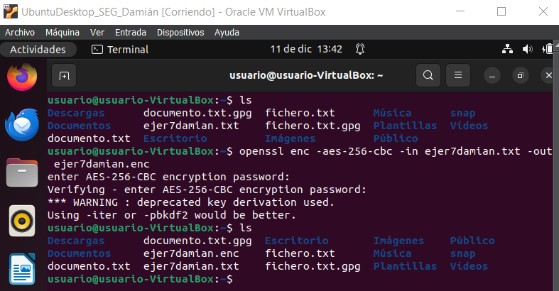
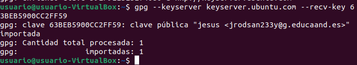

# Actividades Unidad 4 Seguridad - Criptografía

Autor: Damián Martín Carrasco

## Parte 1.- CIFRADO SIMÉTRICO GPG

### 1. Crea un documento de texto con cualquier editor o utiliza uno del que dispongas.

Simplemente creamos un documento de texto mediante el uso de echo y lo volcamos en el fichero que vamos a crear.

```bash
echo "damian" > fichero.txt
```

### 2. Cifra este documento con alguna contraseña acordada con el compañero de al lado.

Ahora ciframos el fichero que acabamos de crear.

**gpg -c fichero.txt**

```
gpg: Comando principal de GnuPG, que se utiliza para cifrar y firmar digitalmente datos.

-c: Esta opción le indica a GnuPG que debe realizar una operación de cifrado simétrico,
lo que significa que se utiliza la misma clave para cifrar y descifrar el archivo.
```

Nos pedirá una contraseña de cifrado.

<p align="center">
  
</p>

### 3. Haz llegar por algún medio al compañero de al lado el documento que acabas de cifrar.

He usado scp para enviar el archivo, para ello tenemos que tener instalado previamente openssh-server desde la máquina servidora y openssh-cliente desde la máquina cliente.

Una vez están instalados los paquetes, usando el comando scp se pasa por ssh el documento al cliente y comprobamos que le ha llegado satisfactoriamente.

<p align="center">
  
</p>

### 4. Descifra el documento que te ha hecho llegar tu compañero de al lado.

Ahora en la máquina cliente desciframos el archivo que hemos pasado desde la otra máquina, para ello usamos gpg --decrypt, en este caso solo puse gpg, que como podemos ver adivinará que queremos descrifrar.

<p align="center">
  
</p>

### 5. ¿Con qué algoritmo se ha cifrado el fichero? Vuelve a cifrar el fichero usando el algoritmo AES256. ¿Puedes hacer permanente esta configuración?

Para ver el algoritmo con el que se ha cifrado el fichero podemos hacer uso de file.

```bash
file fichero.txt.gpg
```

Nos aparecerá el algoritmo, en este caso, AES256.

<p align="center">
  
</p>

Para hacer permanente este cambio podemos usar el siguiente comando.

```bash
gpg --cipher-algo AES256 -c fichero.txt
```

En el caso que muestra la captura, estamos diciéndole que encripte el fichero usando específicamente ese algoritmo.

Además podemos editar o crear el archivo de configuración donde declaramos que por defecto se use ese algoritmo.

<p align="center">
  
</p>

### 6. Instala gpg en windows (Gpg4win), repite el ejercicio en Windows. Puedes encriptar un mensaje en linux y desencriptarlo en windows y al contrario.

Tenemos que descargar Gpg4win y una vez lo tengamos instalado abrimos Kleopatra, que deberíamos haber seleccionado durante la instalación.

Lo primero que tenemos que hacer es generar un certificado, y una vez lo tenemos le damos a Firmar/Cifrar, luego deshabilitamos la casilla de firmar como, eso es algo que veremos más tarde.

Le damos a cifrar para mi y ponemos el certificado que hemos generado antes, marcamos la casilla de cifrar con contraseña y abajo seleccionamos el archivo a cifrar, por último le damos a "Cifrar".

<p align="center">
  
</p>

Le ponemos la contraseña que queramos.

<p align="center">
  
</p>

Y vemos que el archivo se ha cifrado correctamente.

<p align="center">
  
</p>

Para pasar los archivos a la máquina de Linux me descargué e instalé winSCP que es fácil de usar.

Una vez te conectas al usuario de la máquina de Linux sale una interfaz donde puedes ver los directorios y archivos de Windows a un lado (izquierda) y de Ubuntu al otro (derecha), basta con arrastrar el archivo que quieres pasar de un lado al otro.

En este caso pasé de Windows10 un archivo a Ubuntu y viceversa.

<p align="center">
  
</p>

Primero desciframos el que le hemos pasado a Ubuntu, para ello usamos el comando `gpg --decrypt`.

Como podemos ver se ha descifrado bien y ahora es legible.

<p align="center">
  
</p>

En Windows10 simplemente tenemos que abrir Kleopatra y darle a Descifrar/Verificar y seleccionar el archivo, cuando le demos podemos ver que se descifra correctamente.

<p align="center">
  
</p>

Lo abrimos y comprobamos que se conservan sus contenidos.

<p align="center">
  
</p>

### 7. openssl es otra herramienta que nos permite cifrar mensajes de forma simétrica, investiga como se realiza este ejercicio utilizando esta herramienta.

En primer lugar ejecuramos el siguiente comando y comprobamos que se ha creado con éxito.

<p align="center">
  
</p>

```
enc: Se utiliza para realizar operaciones de cifrado y descifrado.

-aes-256-cbc: Esta opción especifica el algoritmo de cifrado y el modo de operación. En este caso, se está utilizando AES con una clave de 256 bits en modo CBC (Cipher Block Chaining).

-in ejer7damian.txt: Indica el nombre del archivo de entrada que se va a cifrar. En este caso, el archivo de entrada se llama "ejer7damian.txt".

-out ejer7damian.enc: Indica el nombre del archivo de salida cifrado. En este ejemplo, el archivo cifrado se llamará "ejer7damian.enc".
```

Pasamos el archivo usando scp de nuevo.

Ahora abrimos el Prompt de OpenSSL en Windows10 (lo hemos tenido que descargar e instalar previamente).

Una vez dentro nos vamos hasta donde está el archivo, y una vez allí lanzamos el siguiente comando

```cmd
openssl enc -d -aes-256-cbc -in ejer7damian.enc -out ejer7damian.txt
```

*Aquí están los mismos parámetros que en el de encriptado, con la diferencia que se usa -d para desencriptar*

Y luego lo abrimos y comprobamos que se ha realizado exitosamente.

<p align="center">
  
</p>

De esta manera se podría realizar usando openssl.

## Parte 2.- FIRMA DIGITAL CON GPG

### 1. Selecciona un documento pdf y encríptalo y fírmalo (opción --sign). Envíalo a un compañero, que debe en primer lugar verificar la firma y posteriormente descifrar el documento.

En el Windows10 podemos realizar el encriptado y firma seleccionando las dos casillas y poniéndole una contraseña.

<p align="center">
  
</p>

Vemos que se ha cifrado y firmado correctamente.

<p align="center">
  
</p>

Ahora en el Ubuntu creamos un nuevo fichero para usarlo, tendremos que generar la clave ahora o no podremos firmarlo tal y como se ve en la imagen, así que generamos una clave con `gpg --gen-key`.

<p align="center">
  
</p>

Aquí podemos comprobar el resto de la imagen de como se crea el par de claves.

<p align="center">
  
</p>

Ahora lo firmamos usando el --sign.

Para ello usamos el siguiente comando.

```bash
gpg --output pdf2_ubuntu_damian.txt.gpg --sign pdf2_ubuntu_damian.txt
```

Nos dirá que ya hay un archivo con ese nombre, por lo que podemos sobreescribirlo o darle otro nombre, en este caso le damos otro nombre.

<p align="center">
  
</p>

Usamos la verificación para comprobar que se ha realizado correctamente la firma.

Ahora vamos a exportar el par de claves usando gpg --export

```bash
gpg --export --armor damimc21@gmail.com > clave_publica.asc
```

Y lo enviamos a la otra máquina con scp de nuevo.

<p align="center">
  
</p>

Ahora en la máquina a la que le hemos pasado el par de claves, añadimos el par de claves al llavero, usando gpg --import

```bash
gpg --import clave_publica.asc
```

Y vemos que se importa correctamente

<p align="center">
  
</p>

Ahora desencriptamos, también podemos usar --verify, y nos sale la firma correcta, podemos ver que el fichero tiene su contenido.

<p align="center">
  
</p>

### 2. Realiza el mismo ejercicio pero obteniendo una firma ASCII.

Ya se realizó en el ejercicio anterior usando --armor.

<p align="center">
  
</p>

### 3. Ahora sólo queremos firmar un documento. Firma un documento (opción --detach-sign). A continuación envía el documento original y la firma a un compañero para que verifique que el documento está firmado por tí.

Creamos un nuevo fichero y lo firmamos con --detach-sign.

<p align="center">
  
</p>

Pasamos el archivo a la otra máquina, y verificamos aquí que está firmado.

<p align="center">
  
</p>

## Parte 3.- INTEGRIDAD, AUTENTICACIÓN, FIRMA

### 1. Manda un documento y la firma electrónica del mismo a un compañero. Verifica la firma que tu has recibido.

Creamos un fichero nuevo, lo firmamos con `gpg --sign`, lo enviamos y luego lo verificamos con `gpg --verify`

<p align="center">
  
</p>

### 2. ¿Qué significa el mensaje que aparece en el momento de verificar la firma?

3. gpg: Firma correcta de "Pepe D <josedom24@gmail.com>" 
[desconocido]

**Esta línea indica que la firma electrónica ha sido verificada correctamente y que el documento fue firmado por la entidad con la dirección de correo electrónico "josedom24@gmail.com" y el nombre "Pepe D".**

4. gpg: ATENCIÓN: ¡Esta clave no está certificada por una firma de 
confianza!

**Este mensaje advierte que la clave pública utilizada para verificar la firma no tiene una certificación de confianza.**

5. gpg: No hay indicios de que la firma pertenezca al 
propietario.

**Esta línea indica que, según la información disponible, no hay pruebas directas de que la clave pertenezca al propietario declarado ("Pepe D").**

6. Huellas dactilares de la clave primaria: E8DD 5DA9 3B88 F08A 
DA1D 26BF 5141 3DDB 0C99 55FC

**Estas son las huellas dactilares (fingerprints) de la clave pública principal. Son una forma única de identificar una clave y deberían coincidir con las que "Pepe D" te ha proporcionado en persona o a través de un canal seguro.**


### Ejercicios 7, 8, 9 y 10 de Tarea 1

Primero listamos las firmas asociadas con las claves públicas y privadas, para ello `gpg --list-sigs` y compiamos el **sig**.

<p align="center">
  
</p>

Luego enviamos el id que habiamos copiado y lo subimos a un servidor.

<p align="center">
  
</p>

Y ahora importamos la clave de nuestro compañero.

<p align="center">
  
</p>

Firmamos la clave de nuestro compañero tras importarla.

<p align="center">
  
</p>

Ahora podemos comprobar que tiene las dos firmas la clave.

<p align="center">
  
</p>

### Tarea 2

Abrimos la aplicación de correo, le damos a Editar y preferencias, luego nos dirigimos hasta **Preferencias del editor** luego a **Firmas**, allí le damos a **Añadir** y ponemos nuestra nueva firma con el id publico que copiamos antes.

<p align="center">
  
</p>

Ahora ya podemos enviar un nuevo mensaje, le damos a **Nuevo** y allí ponemos el destinatario, en este caso será Jesús, le ponemos un asunto y un mensaje y luego en **Opciones** marcamos la opción **Cifrar con PGP** y en **Firma** ponemos pública.

<p align="center">
  
</p>

Y comprobamos ahora que se envía el correo correctamente.

<p align="center">
  
</p>

### Tarea 3

En primer lugar tenemos que descargar las cosas necesarias que nos indican.

<p align="center">
  
</p>

Y luego usamos los comandos de la guía para comprobar la iso, como podemos ver nos muestra la información del primero y no de los otros dos, ya que solo he descargado el primero.

<p align="center">
  
</p>

Para verificar que el contenido del hash que hemos utilizado no haya sido manipulado, usamos la firma digital que se encuentra en el repositorio.

Descargamos la clave pública del firmante mediante

```bash
gpg --keyserver keyring.debian.org --recv 6294BE9B
```

Y verificamosla firma de los archivos de suma de comprobación.

```bash
gpg --verify SHA512SUMS.sign SHA512SUMS
```

<p align="center">
  
</p>

### Tarea 4

1. **Software utilizado por apt secure para criptografía asimétrica:**
   Apt secure utiliza GnuPG (GNU Privacy Guard) para realizar la criptografía asimétrica.

2. **Comando apt-key:**
   El comando `apt-key` se utilizaba anteriormente para gestionar las claves GPG del sistema, pero ha sido considerado obsoleto y se desaconseja su uso en versiones recientes de apt. Se recomienda utilizar el mecanismo de gestión de claves incorporado en GnuPG. El comando `apt-key list` mostraba la lista de claves GPG agregadas al sistema.

3. **Fichero que guarda el anillo de claves de apt-key:**
   El anillo de claves que gestionaba `apt-key` se guardaba en el directorio `/etc/apt/trusted.gpg` y `/etc/apt/trusted.gpg.d/`. Sin embargo, hay que tener en cuenta que el uso de `apt-key` ha sido desaconsejado, y se recomienda utilizar GnuPG directamente.

4. **Contenido de los archivos Release y Release.gpg:**
   - El archivo `Release` de un repositorio de paquetes contiene información sobre las versiones de los paquetes disponibles, sus dependencias y otra información relevante.
   - El archivo `Release.gpg` es la firma GPG del archivo `Release`. Se utiliza para verificar la autenticidad e integridad del archivo `Release`.

5. **Proceso para asegurar la legitimidad de los archivos descargados:**
   - Durante el proceso de `apt update`, se descargan los archivos `Release` y `Release.gpg` del repositorio.
   - La firma GPG (`Release.gpg`) se verifica utilizando la clave pública del repositorio para garantizar la autenticidad del archivo `Release`.
   - Si la firma es válida, se utiliza la información en el archivo `Release` para construir la base de datos local de paquetes disponibles.
   - Los paquetes se descargan de los repositorios utilizando la información verificada.

6. **Agregar el repositorio de VirtualBox con su clave pública:**
   - Agrega el repositorio de VirtualBox al archivo de fuentes de apt. Puedes hacerlo creando un nuevo archivo, por ejemplo, `/etc/apt/sources.list.d/virtualbox.list`, y añadiendo la línea:

     ```bash
     deb [arch=amd64] https://download.virtualbox.org/virtualbox/debian buster contrib
     ```

     (Hay que cambiar `buster` por el nombre de tu versión de Debian).

   - Descarga e importa la clave pública de VirtualBox:

     ```bash
     wget -q https://www.virtualbox.org/download/oracle_vbox_2016.asc -O- | gpg --dearmor > /usr/share/keyrings/virtualbox-archive-keyring.gpg
     ```

   - Actualiza la lista de paquetes:

     ```bash
     sudo apt-get update
     ```

   - Ahora puedes instalar VirtualBox u Oracle VM VirtualBox desde este repositorio. Estos comandos pueden variar según la versión específica de Debian que usemos.

### Tarea 5

1. **Cifrado de la información en el protocolo:**
   - **Cifrado Simétrico:** En el cifrado simétrico, una clave única se comparte entre el cliente y el servidor. Esta clave se utiliza tanto para cifrar como para descifrar la información. Es eficiente pero requiere que ambas partes compartan la clave de forma segura.
   
   - **Cifrado Asimétrico:** En el cifrado asimétrico, cada entidad tiene un par de claves: pública y privada. La clave pública se comparte abiertamente, mientras que la clave privada se mantiene secreta. La información cifrada con la clave pública solo puede descifrarse con la clave privada correspondiente. Este método es útil para la autenticación y el intercambio seguro de claves.

2. **Métodos de autenticación:**
   - **Por Contraseña:** El cliente envía una contraseña al servidor para la autenticación. Este método es simple pero susceptible a ataques de fuerza bruta y captura de contraseña.

   - **Utilizando un Par de Claves Públicas y Privadas:** Se genera un par de claves: una pública y una privada. La clave pública se comparte con el servidor, mientras que la clave privada se guarda en el cliente. Durante la autenticación, el cliente firma un desafío del servidor con su clave privada, y el servidor verifica la firma utilizando la clave pública del cliente.

3. **Contenido del fichero `~/.ssh/known_hosts`:**
   - Este fichero almacena las claves públicas de los servidores a los que el cliente se ha conectado anteriormente. Cuando te conectas a un servidor SSH, se compara la clave pública del servidor con la que está almacenada en `known_hosts`. Si la clave no coincide, el cliente emite una advertencia para evitar posibles ataques de hombre en el medio.

4. **¿Qué significa este mensaje que aparece la primera vez que nos conectamos a un servidor?**

$ ssh debian@172.22.200.74
The authenticity of host '172.22.200.74 (172.22.200.74)' can't 
be established.
ECDSA key fingerprint is
SHA256:7ZoNZPCbQTnDso1meVSNoKszn38ZwUI4i6saebbfL4M.
Are you sure you want to continue connecting (yes/no)? 

**"The authenticity of host '172.22.200.74 (172.22.200.74)' can't be established":**

   - Indica que la autenticidad del host (servidor) no puede ser confirmada en este momento. Suele suceder la primera vez que te conectas a un nuevo servidor o cuando el servidor ha cambiado su clave desde la última conexión.

**"ECDSA key fingerprint is SHA256:7ZoNZPCbQTnDso1meVSNoKszn38ZwUI4i6saebbfL4M":**
   - Muestra la huella digital (fingerprint) de la clave pública del servidor. Es una representación única de la clave y se utiliza para identificar el servidor. La huella digital se calcula utilizando el algoritmo de firma ECDSA y se presenta en formato SHA256.

**"Are you sure you want to continue connecting (yes/no)?":**
   - Pregunta si estás seguro de que deseas continuar con la conexión. Antes de responder, debes verificar la autenticidad de la huella digital. Si estás seguro de que la conexión es legítima y que la huella digital corresponde al servidor al que intentas conectarte, puedes responder "yes" para continuar.

9. **En ocasiones cuando estamos trabajando en el cloud, y reutilizamos una ip flotante nos aparece este mensaje:**

$ ssh debian@172.22.200.74
@@@@@@@@@@@@@@@@@@@@@@@@@@@@@@@@@@@@@@@@@@@@@@@@@@@@@@@@@@@
 @ WARNING: REMOTE HOST IDENTIFICATION HAS CHANGED! @
@@@@@@@@@@@@@@@@@@@@@@@@@@@@@@@@@@@@@@@@@@@@@@@@@@@@@@@@@@@
IT IS POSSIBLE THAT SOMEONE IS DOING SOMETHING NASTY!
 Someone could be eavesdropping on you right now (man-in-themiddle attack)!
 It is also possible that a host key has just been changed.
 The fingerprint for the ECDSA key sent by the remote host is
SHA256:W05RrybmcnJxD3fbwJOgSNNWATkVftsQl7EzfeKJgNc.
 Please contact your system administrator.
Add correct host key in /home/jose/.ssh/known_hosts to get rid 
of this message.
Offending ECDSA key in /home/jose/.ssh/known_hosts:103
remove with:
ssh-keygen -f "/home/jose/.ssh/known_hosts" -R 
"172.22.200.74"
ECDSA host key for 172.22.200.74 has changed and you have 
requested strict checking.

Este mensaje indica que la identificación del host remoto ha cambiado desde la última vez que se conectó a la dirección IP especificada (172.22.200.74).

1. **"WARNING: REMOTE HOST IDENTIFICATION HAS CHANGED!":**
   - Advierte que la identificación del host remoto ha cambiado desde la última conexión.

2. **"IT IS POSSIBLE THAT SOMEONE IS DOING SOMETHING NASTY! Someone could be eavesdropping on you right now (man-in-the-middle attack)!":**
   - Advierte sobre la posibilidad de un ataque de hombre en el medio, donde alguien podría estar interceptando tu conexión y realizando actividades maliciosas.

3. **"It is also possible that a host key has just been changed. The fingerprint for the ECDSA key sent by the remote host is SHA256:W05RrybmcnJxD3fbwJOgSNNWATkVftsQl7EzfeKJgNc.":**
   - Informa que otra posibilidad es que la clave del host haya cambiado recientemente. Muestra la nueva huella digital de la clave ECDSA del host remoto.

4. **"Please contact your system administrator.":**
   - Sugiere que te pongas en contacto con el administrador del sistema para confirmar el cambio o investigar cualquier actividad sospechosa.

5. **"Add correct host key in /home/jose/.ssh/known_hosts to get rid of this message. Offending ECDSA key in /home/jose/.ssh/known_hosts:103 remove with: ssh-keygen -f "/home/jose/.ssh/known_hosts" -R "172.22.200.74":**
   - Proporciona instrucciones sobre cómo solucionar el problema. Puedes eliminar la entrada antigua del archivo `known_hosts` con el comando `ssh-keygen` proporcionado.

6. **"ECDSA host key for 172.22.200.74 has changed and you have requested strict checking.":**
   - Indica que la clave ECDSA del host para la dirección IP especificada ha cambiado y que tienes configurada la verificación estricta de claves.
  
## Parte 4.- 

### Tarea 1 Generación de claves

Para generar un par de claves usando GPG podemos usar simplemente `gpg --gen-key`.

<p align="center">
  
</p>

El directorio predeterminado donde se guargan las claves es `/home/usuario/.gnupg/` o lo que es lo mismo `~/.gnupg/`.

Para listar las claves públicas debemos usar este comando `gpg --list-keys`.

<p align="center">
  
</p>

Este comando mostrará la información sobre las claves públicas almacenadas. Los datos incluirán:

- Clave pública ID: Identificador único de la clave pública.
- Tipo de clave y tamaño: Algoritmo y longitud de la clave.
- Fecha de creación: Fecha en que se generó la clave.
- Fecha de expiración: Si se estableció una fecha de expiración.
- Propietario: Dirección de correo electrónico asociada con la clave.

Para indicar que tenga 1 mes de validez debemos hacer lo siguiente:

```bash
gpg --edit-key [ID_DE_CLAVE]
expire
1m
save
```

De esta manera editaremos correctamente la caducidad, hemos de copiar primero el ID de la clave.

<p align="center">
  
</p>

Y para listar las claves privadas simplemente tenemos que hacer `gpg --list-secret-keys`.

<p align="center">
  
</p>

### Tarea 2 Importar / exportar clave pública

Exportamos el par de claves usando gpg --export y --armor para ASCII

```bash
gpg --export --armor damimc21@gmail.com > clave_publica.asc
```

Y lo enviamos a la otra máquina con scp de nuevo.

<p align="center">
  
</p>

Ahora en la máquina a la que le hemos pasado el par de claves, añadimos el par de claves al llavero, usando gpg --import

```bash
gpg --import clave_publica.asc
```

Y vemos que se importa correctamente.

<p align="center">
  
</p>

Comprobamos.

<p align="center">
  
</p>

### Tarea 3 Cifrado asimétrico con claves públicas   

Primero encriptamos un archivo y se lo enviamos a alguien, en este caso a otra máquina virtual mediante ssh, con scp.

para encriptar el archivo.

<p align="center">
  
</p>

Después de recipient podemos poner el nombre que se le dio al dueño de las claves.

Tras enviarlo a la otra máquina podemos observar que al principio no deja descifrarlo porque no tiene la clave secreta, tras hacer el import con la clave privada, volvemos a ejecutar el comando y ya si lo desencripta exitosamente.

<p align="center">
  
</p>

Y para borrar las claves, primero hay que borrar la secreta, de la siguiente forma.

<p align="center">
  
</p>

Y podemos comprobar que ya no existe.

Y tras borrar la secreta podemos borrar la publica, de igual manera.

<p align="center">
  
</p>

También se queda sin ninguna clave pública.

### Tarea 4 Exportar clave a un servidor público de claves PGP

Para generar una clace de revocación lo primero que tenemos que hacer es listar las claves y coger el id de la que queremos generar la clave de revocación, después le introducimos el comando `gpg --gen-revoke 'id'` 

Tras esto tendremos que responder a unas pocas preguntas y finalmente generaremos el código de revocación.

<p align="center">
  
</p>

Ahora para subir la clave pública a un servidor tendremos que hacerlo con el comando `gpg --send-keys --keyserver`

En este caso he probado 2 porque el primero no me funcionaba, pero el segundo si.

<p align="center">
  
</p>

Para borrar la clave pública de un compañero tendríamos que hacer lo siguiente `gpg --delete-key 'RSA'`

para descargarlo lo haremos de la siguiente manera `gpg --keyserver 'server' --recv-key 'id'`

### Tarea 5 Cifrado asimétrico con openssl

Con openssl tenemos que generar primero la clave privada y a partir de esa clave privada generar clave pública.

Primero ejecutamos `openssl genpkey -algorithm RSA -out private_key.pem`

Y luego ejecutamos a partir del otro `openssl pkey -in private_key.pem -pubout -out public_key.pem`

<p align="center">
  
</p>

De esa manera lo tenemos.

Ahora lo enviamos al compañero, en este caso otra máquina virtual.

<p align="center">
  
</p>

Y lo hemos cifrado con clave pública de la otra máquina.

<p align="center">
  
</p>

Para descifrarlo simplemente abría que poner

```bash
openssl pkeyutl -decrypt -in arch_cifrado.enc -out descifrado.txt -inkey public_key.pem
```

## Parte 5.- CERTIFICADOS DIGITALES CON SSL

NO TENGO EL CERTIFICADO DIGITAL
